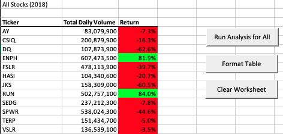

# VBA of Wall Street

## Overview of Project
### Purpose

Using VBA code to automate analyses of stock data.

## Results

### Stock Performance

I calculated the return for each stock over both the 2017 and 2018 years. The yearly return is the percentage increase or decrease in price from the beginning of the year to the end of the year. I found this by iterating through the rows of each data set with a for loop and storing the starting and ending prices with an if-then statement:

```
 'Loop over all the rows in the spreadsheet.
    For i = 2 To RowCount
    
        'Increase volume for the current ticker
        tickerVolumes(tickerIndex) = tickerVolumes(tickerIndex) + Cells(i, 8).Value
        
        'Check if the current row is the first row with the selected tickerIndex; then store starting price
        If Cells(i - 1, 1).Value <> tickers(tickerIndex) Then
            
                tickerStartingPrices(tickerIndex) = Cells(i, 6).Value
                
        End If
        
        'check if the current row is the last row with the selected ticker; then store ending price
         'If the next row’s ticker doesn’t match, increase the tickerIndex
        If Cells(i + 1, 1).Value <> tickers(tickerIndex) Then
        
            tickerEndingPrices(tickerIndex) = Cells(i, 6).Value
            
            'Increase the tickerIndex.
            tickerIndex = tickerIndex + 1
            
        End If
    
    Next i

```
I then calculated yearly return by dividing the ending price by the starting price, subtracting 1, then outputting it to the third column titled “Return”. 

```
Cells(i + 4, 3).Value = tickerEndingPrices(tickerIndex) / tickerStartingPrices(tickerIndex) - 1

```

The performance in 2017 for the 12 respective stocks was better than that of the stocks in 2018. In 2017, 92% of the 12 stocks had a positive return, while there were only about 16.7% of stocks with a positive return in 2018. The only stock in 2017 with a negative return was TERP. In 2018, the only stocks with positive returns were ENPH and RUN. 




### Execution Time  

After refactoring the code, the execution time decreased for both the stock data from 2017 and 2018. With the original code, the analysis on 2017 stock data took about 0.68 seconds to execute, while the analysis on the 2018 stock data took about 0.70 seconds. The refactored code took about 0.13 seconds to perform analysis on the 2017 stock data, and 0.12 seconds to perform the analysis on 2018 stock data. The following images are the execution times of the analyses with the refactored code:


## Summary

Refactoring code can make it easier to understand, more organized, and help speed up the execution time. Although you are not changing the external behavior, you are restructuring what you already have and trying to improve its efficiency. One disadvantage could be if you end up spending more time refactoring the code than if you just rewrote it. 

Refactoring the original VBA script made the execution time a lot shorter. I formatted and commented the code to make it cleaner and more organized. In this case, refactoring the code didn’t take long and ended up making the code a lot more useful than the original, as we we could now execute the analyses a lot quicker if given more data. 
